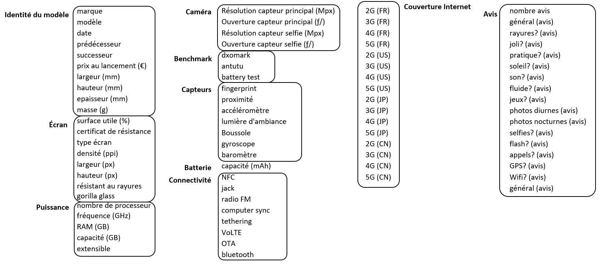

# obsolescence_prediction
Détermination des risques d'obsolescence dans les smartphones

- **Constat :** évolution très rapide des smartphones dans le temps 
- **Segment d'étude :** segment de marché du haut de gamme
- **Objectif de l'étude :** détecter et prédire la fin de vie d'un produit.

## diagramme de fonctionnement pour l'interface graphique

## Définition de l'obsolescence

On peut distinguer deux formes d'obsolescence : 
- **l'obsolescence technologique** liée aux limites technologiques du produit : fin de vie des composants, produit plus assez performant etc..
- **l'obsolescence psychologique** liée à la perception du produit par le consommateur : produit démodé, nouveau produit avec un meilleur design etc

On peut définir l'obsolescence comme étant :
- **la période entre la date de sortie d'un produit et la date de retrait à la vente.** Il nous faut donc la quantité de vente en fonction du temps mais problèmes de confidentialité pour le volume de vente d'un smartphone en particulier : cette information n'est pas publique
- **la période pendant laquelle le produit est maintenu.** Par exemple au bout de 7 ans Apple ne délivre plus de mise à jour des drivers et de l'OS. Problème de pertinence car la période de maintenance peut être arbitrairement fixé à un certain nombre d'année par un constructeur pour tous ces modèles indépendemment de tous les facteurs que l'on veut considérer dans cette étude. (voir raisons multiples de l'obsolescence)

## Obtention d'une estimation de l'obsolescence à la vente d'un produit

### Idée 1 (Press release)
Déterminer le volume de vente par trimestre de chaque modèle de smartphone à partir de :
- la vente totale ("de tous les modèles de smartphones") trimestrielle communiqué par l'entreprise 
- le diagramme de gantt des modèles sortis
- la courbe type de vente de chaque modèle en fonction du temps (gaussienne ?)

-> exemple : cas des iphones 
-> critique : le nombre de modèles d'iphone : la technique perdra beaucoup de justesse s'il y a beaucoup de modèle dans la gamme (eg. samsung)

### Idée 2 (Google trends)
Déterminer le volume de vente de chaque modèle de smartphone à partir des pics d'intérêt pour un produit des utilisateurs du moteur de recherche google.
La largeur de la courbe pour un certain sigma donné donnera une estimation de l'obsolescence du produit.

### Idée 3 (Commentaires amazon)
Déterminer le volume de vente par trimestre de chaque modèle de smartphone à partir du nombre de commentaires émis pendant un trimestre sous un .
La largeur de la courbe pour un certain sigma donné donnera également une estimation de l'obsolescence du produit.

### Des raisons multiples de l'obsolescence

- concurrents
- technologie
- effet de mode 

### 3 sources d'exploration 

#### Les caractéristiques techniques 

La période couverte est de 10 ans.

--> sources des caractéristiques générales : 

- kimovil.com
https://www.kimovil.com/fr/comparatif-smartphone/f_min_d+eurPrice.640 pour avoir une idée des marques dans le segment haut de gamme actuellement
https://www.kimovil.com/fr/prix-telephones-apple pour avoir les caractéristiques de tous les modèles de la marque apple
https://www.kimovil.com/fr/prix-telephones-samsung ...ou samsung

--> sources des benchmark des performances des smartphones

- **antutu** [CPU + GPU + MEM + UX] : _kimovil.com_
- **dxomark** [camera] : _dxomark.com_
- **battery life test** [battery] : _gsmarena.com/battery-test.php3_

#### Les nouvelles dynamiques (/!\ recherche sémantique)

- **Brevets déposés** 

-> google patent : https://www.google.com/?tbm=pts

brevet déposé : hypothèse que brevets tout de suite se concrétisent rapidement en produit vendu

- **Partenariats** avec une marque lambda
exemple de Huawei, champion des cameras (frontale et principale) depuis son partenariat avec Leica

-> google actualité dans les archives : 
https://news.google.com/search?q=partenariat%20smartphone&hl=fr&gl=FR&ceid=FR%3Afr aujourd'hui
https://www.google.com/search?q=partenariat+smartphone&rlz=1C1EKKP_enFR749FR749&biw=1920&bih=1067&source=lnt&tbs=cdr%3A1%2Ccd_min%3A2007%2Ccd_max%3A2008&tbm=nws en 2007

#### Les consommateurs

- google trends
- commentaires amazon
- appréciation kimovil /10

## État de l'art : étude de 2016 de Jennings, Wu et Terpenny

### Résumé de l'étude

Une étude similaire à celle que nous cherchons à effectuer a déjà été réalisée : https://ieeexplore-ieee-org.gorgone.univ-toulouse.fr/document/7543522

L'étude se focalise davantage sur l'obsolescence technique que sur l'obsolescence psychologique. Les chercheurs ont rassemblés les caractéristiques techniques d'environ 7000 téléphones grâce à du web scrapping. Ces données sont accessibles à l'adresse http://connor.ie/research. A partir de ces données, ils ont essayé de créer un modèle permettant de prédire le risque d'obsolescence d'un smartphone.
ils ont utilisé diverses méthodes comme des forêts aléatoires, des réseaux de neurone et des machines supports vecteurs. La meilleure précision semble venir des forêts aléatoires.

### Critique de l'étude

Cette étude date de 2016. Depuis, de nombreux smartphones ont vu le jour et mériteraient d'être ajoutés au modèle. De plus le modèle développé n'inclut pas vraiment la perception du consommateur sur le produit : pour créer la courbe du cycle de vie du smartphone, les chercheurs ont utilisé essentiellement les ventes des smartphones. Il serait intéressant de creuser davantage l'impact du marketing sur l'obsolescence. Enfin les caractéristiques techniques étudiés pourraient être plus complètes : l'une d'elle était la possibilité d'envoyer des SMS, ce que n'importe quelle smartphone peut faire aujourd'hui. Il pourrait être pertinent, d'utiliser des informations provenant de benchmark pour avoir des informations pointues sur les caractéristiques techniques des smartphones.  